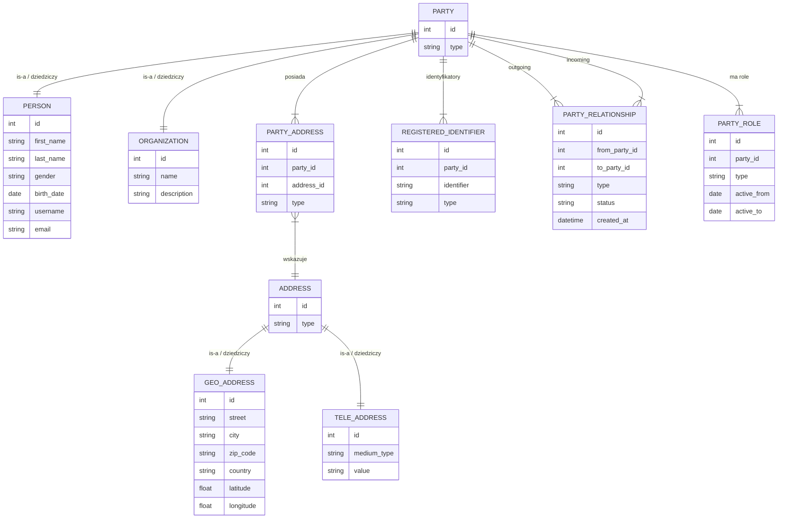

# Implementacja Archetypu Party (Strona/Podmiot) - Dokumentacja Techniczna

## Diagram ERD (Mermaid JS)



## Uzasadnienie Archetypu Party (Strona/Podmiot)

Ta implementacja realizuje **Archetyp Party (Strona/Podmiot)** poprzez **uogólnienie** wszystkich bytów działających w systemie (osób i organizacji) do wspólnego nadtypu `Party`. Model wykorzystuje **Dziedziczenie tabel połączonych (Joined Table Inheritance)**, co pozwala zachować specjalizację przy jednoczesnym utrzymaniu **pojedynczej tożsamości** każdej strony dzięki wspólnemu kluczowi głównemu `party.id`. Powstaje spójny, **polimorficzny** model domenowy: referencja `Party` może w czasie działania jednoznacznie wskazywać na `Person` lub `Organization`.

## Rozwiązanie problemów i kontekst SRS

- **Integralność danych:** Wspólna tabela `party` zapewnia **brak kolizji identyfikatorów** pomiędzy użytkownikami i grupami. Każdy użytkownik lub organizacja funkcjonuje w jednej przestrzeni tożsamości.
- **Gym Bro Chat:** Wiadomości mogą być kierowane do identyfikatora `Party` bez wiedzy, czy adresatem jest osoba czy grupa. Umożliwia to ujednolicony interfejs komunikacji i przyszłą logikę routingu.
- **Zarządzanie relacjami:** Przyjaźnie, członkostwa i relacje trenerskie są przechowywane w jednej tabeli relacji, co upraszcza powiązania między typami i wymusza spójne śledzenie statusów.

## Identyfikatory Rejestrowe (Registered Identifiers)

Zamiast przechowywać pola takie jak `nip` czy `pesel` bezpośrednio w tabeli `Person`, stosowana jest osobna tabela `registered_identifier`. Rozwiązuje to problem **pustych kolumn (sparse columns)**: cudzoziemiec nie ma numeru PESEL, a osoba fizyczna nie posiada NIP. Oddzielna tabela pozwala przechowywać dowolne identyfikatory (np. numer karty klubowej, licencję, dokument tożsamości) bez zmiany schematu bazy danych.

## Zarządzanie Adresami (PartyAddress)

Relacja między `Party` i `Address` jest realizowana przez **tabelę asocjacyjną** `PartyAddress`, a nie bezpośredni klucz obcy. To umożliwia przypisanie **typu adresu** w kontekście konkretnej strony, np. "DOMOWY", "WYSYŁKOWY", "SIŁOWNIA". Jedna osoba może posiadać wiele adresów, a teoretycznie pojedynczy adres może zostać powiązany z więcej niż jedną stroną.

## Relacje między Stronami (Party Relationships)

`PartyRelationship` to rdzeń modułu społecznościowego. Rekord łączy `from_party_id` oraz `to_party_id`, dzięki czemu jeden mechanizm obsługuje relacje między dowolnymi typami stron. Przykłady:

- **Person -> Person** (Type: "FRIENDSHIP") = Znajomi.
- **Person -> Organization** (Type: "MEMBERSHIP") = Członkowie grupy.
- **Person -> Person** (Type: "COACHING") = Trener i podopieczny.

Taki model upraszcza logikę domenową, ujednolica API i umożliwia rozwój kolejnych relacji bez rozbudowy schematu.

## Szczegóły implementacyjne

- **Stos technologiczny:** Python, FastAPI, SQLAlchemy 2.0
- **Strategia:** Dziedziczenie tabel połączonych (Joined Table Inheritance)
- **Baza danych:** PostgreSQL

## Testy i weryfikacja

Zautomatyzowana weryfikacja znajduje się w [tests/test_party_archetype.py](tests/test_party_archetype.py). Test wykonuje następującą sekwencję:

1. **Utwórz Person** przez POST `/people/`
2. **Utwórz Organization** przez POST `/organizations/`
3. **Pobierz oba** poprzez polimorficzny endpoint `/parties/{id}`

**Polecenie:**

```bash
docker compose exec backend pytest
```

**Przykładowy wynik sukcesu (fragment):**

```text
============================= test session starts ==============================
collected 1 item

backend/tests/test_party_archetype.py .                                  [100%]

============================== 1 passed in 0.42s ===============================
```
